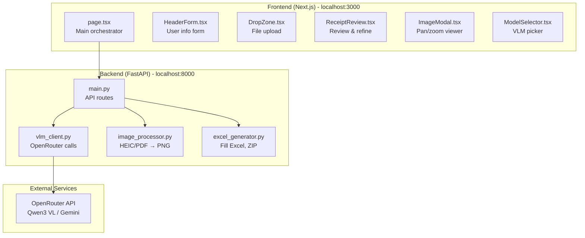
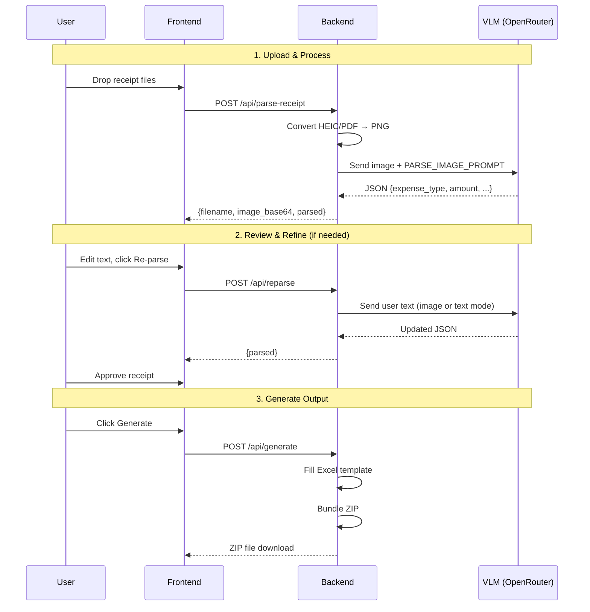
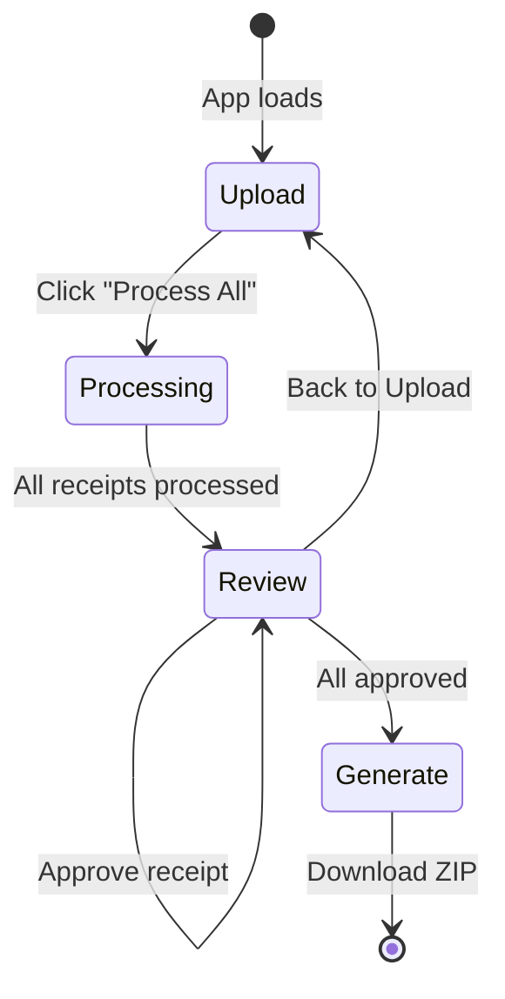
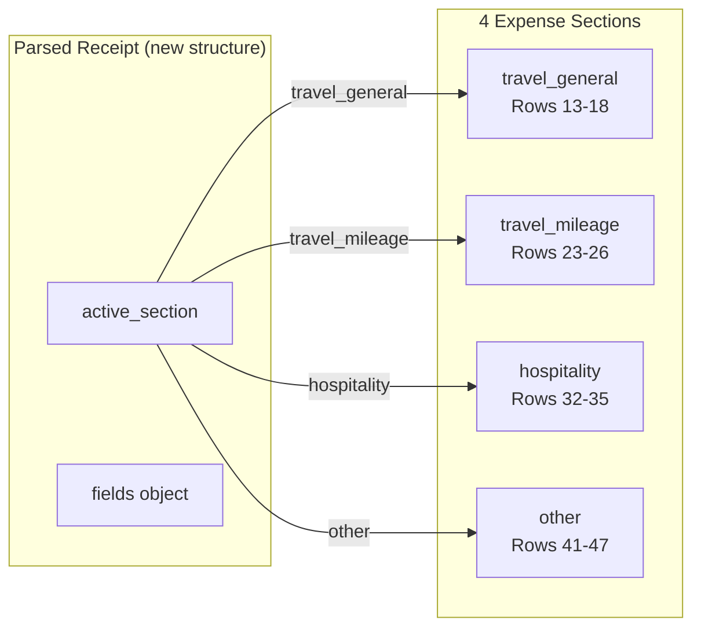

# Codebase Context for AI Agents

This document provides a high-level overview of the Expense Receipt Processor codebase to help AI agents quickly understand the architecture and navigate the code.

## Project Purpose

Automate filling Imperial College E1 expense forms by:
1. Processing receipt images (OCR + semantic understanding) via Vision LLMs
2. Allowing human review/correction of extracted data
3. Generating filled Excel forms + renamed receipt files

## Architecture Overview



## Data Flow



## Key Files Deep Dive

### Frontend

| File | Purpose | Key Functions |
|------|---------|---------------|
| `frontend/app/page.tsx` | Main orchestrator, type definitions | `processAllReceipts()`, `handleReparse()`, `handleGenerate()`, `handleUpdateParsed()` |
| `frontend/components/ReceiptReview.tsx` | Receipt review UI with type-specific collapsible sections | 4 sections (Travel General, Mileage, Hospitality, Other), inline field editing, VLM chat |
| `frontend/components/ImageModal.tsx` | Full-screen image viewer | Pan/zoom with react-zoom-pan-pinch, keyboard controls |
| `frontend/components/HeaderForm.tsx` | User info form | Auto-saves to localStorage, exchange rate field |
| `frontend/components/DropZone.tsx` | File upload | Drag & drop, file type filtering |
| `frontend/components/ModelSelector.tsx` | VLM model picker | Dropdown to select VLM model |

### Backend

| File | Purpose | Key Functions |
|------|---------|---------------|
| `backend/main.py` | FastAPI app, routes | `parse_receipt()`, `reparse_receipt()`, `generate_output()` |
| `backend/services/vlm_client.py` | VLM integration | `parse_receipt_image()`, `parse_receipt_text()`, `refine_receipt()` |
| `backend/services/excel_generator.py` | Excel output | `fill_excel_template()`, `create_output_zip()` |
| `backend/services/image_processor.py` | Image conversion | `convert_to_png_base64()`, `convert_pdf_to_png_base64()` |

## State Machine



## Excel Mapping & Type-Specific Fields

The system uses **type-specific field structures** that match Excel columns for each section:



### E1 Form Section Details

| Section | Rows | Fields |
|---------|------|--------|
| **Travel General** | 13-18 | Date, Mode (AIR TRAVEL/RAIL/TAXI/CAR HIRE/CAR PARKING/OTHER), Return?, From, To, Foreign Currency, Sterling Total, Non UK/EU |
| **Travel Mileage** | 23-26 | Date, Number of Miles, Return?, From, To, Cost per Mile |
| **Hospitality** | 32-35 | Date, Principal Guest, Organisation, Total Numbers, Foreign Currency, Sterling Total, Non-college Staff |
| **Other/Subsistence** | 41-47 | Date, Expense Type (HOTEL/SUBSISTENCE/CONFERENCE FEES/etc), Description, Foreign Currency, Sterling Total, Non UK/EU |

### ParsedReceipt Data Structure

```typescript
interface ParsedReceipt {
  active_section: 'travel_general' | 'travel_mileage' | 'hospitality' | 'other'
  confidence: 'high' | 'medium' | 'low'
  raw_description: string
  fields: {
    travel_general: { date, mode, is_return, from_location, to_location, foreign_currency, sterling_total, is_non_uk_eu }
    travel_mileage: { date, miles, is_return, from_location, to_location, cost_per_mile }
    hospitality: { date, principal_guest, organisation, total_numbers, foreign_currency, sterling_total, non_college_staff }
    other: { date, expense_type, description, foreign_currency, sterling_total, is_non_uk_eu }
  }
}
```

See `SECTION_TO_EXCEL` in `excel_generator.py` for section routing.

## VLM Prompts

Located in `vlm_client.py`:
- `PARSE_IMAGE_PROMPT` - For image-based parsing (OCR + semantic understanding)
- `PARSE_TEXT_PROMPT` - For text-only parsing (user describes receipt)
- `refine_receipt()` - VLM chat for complex operations (e.g., "divide by 6 for shared bill")

All prompts return the type-specific JSON structure with `active_section`, `confidence`, `raw_description`, and `fields` containing all 4 section field objects.

## Common Modifications

### Add a new VLM model
Edit `backend/main.py`:
```python
AVAILABLE_MODELS = [
    {"id": "model-provider/model-name", "name": "Display Name"},
    ...
]
```

### Add a new expense type
1. Add to `VALID_EXPENSE_TYPES` in `vlm_client.py`
2. Add mapping in `EXPENSE_SECTION_MAP` in `excel_generator.py`
3. Update fill function if new section needed

### Change Excel template
1. Analyze new template structure with openpyxl
2. Update row numbers in `excel_generator.py`
3. Update fill functions for correct columns

## Environment Variables

| Variable | Description |
|----------|-------------|
| `OPENROUTER_API_KEY` | API key for OpenRouter VLM access |

## Dependencies

### Backend
- fastapi, uvicorn - Web framework
- openai - OpenRouter client (OpenAI-compatible API)
- openpyxl - Excel manipulation
- pillow, pillow-heif - Image processing
- pymupdf - PDF to image conversion (no external dependencies)

### Frontend
- next, react - UI framework
- tailwindcss - Styling
- react-zoom-pan-pinch - Image pan/zoom in modal viewer
