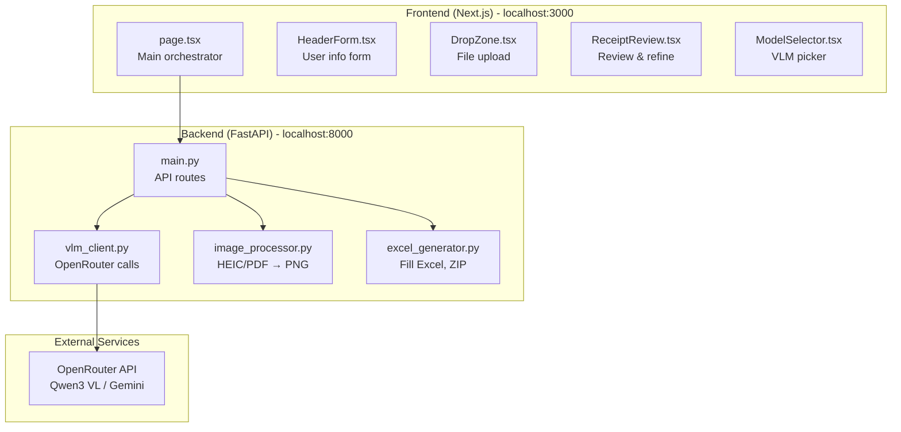
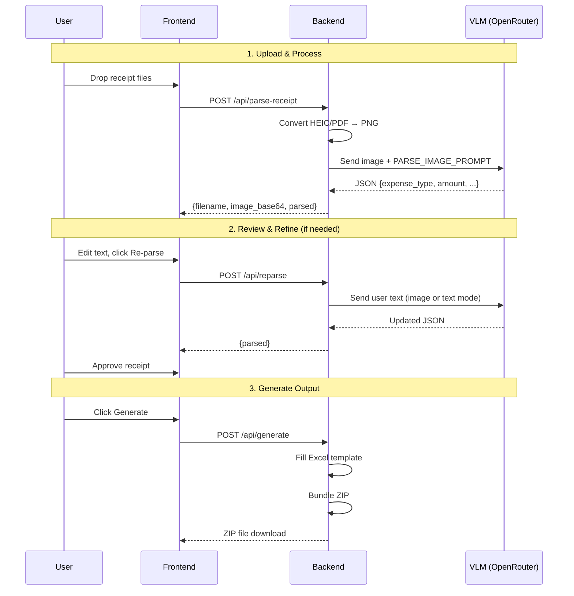
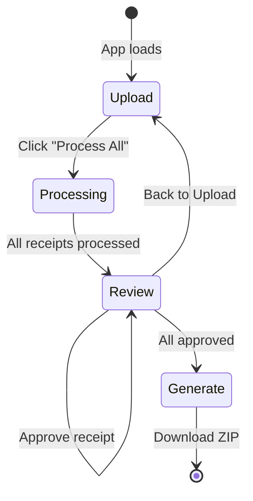
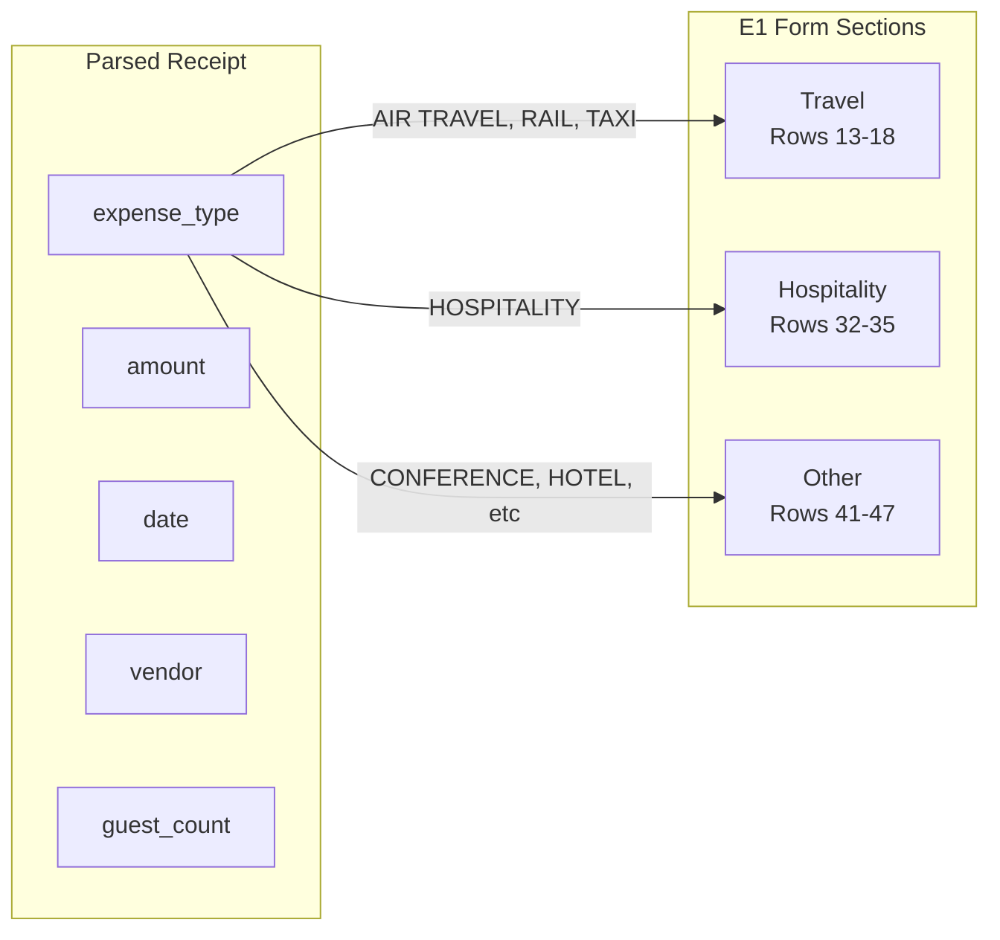

# Codebase Context for AI Agents

This document provides a high-level overview of the Expense Receipt Processor codebase to help AI agents quickly understand the architecture and navigate the code.

## Project Purpose

Automate filling Imperial College E1 expense forms by:
1. Processing receipt images (OCR + semantic understanding) via Vision LLMs
2. Allowing human review/correction of extracted data
3. Generating filled Excel forms + renamed receipt files

## Architecture Overview



## Data Flow



## Key Files Deep Dive

### Frontend

| File | Purpose | Key Functions |
|------|---------|---------------|
| `frontend/app/page.tsx` | Main orchestrator | `processAllReceipts()`, `handleReparse()`, `handleGenerate()` |
| `frontend/components/ReceiptReview.tsx` | Receipt review UI | Parse mode toggle, re-parse button, approve flow |
| `frontend/components/HeaderForm.tsx` | User info form | Auto-saves to localStorage |
| `frontend/components/DropZone.tsx` | File upload | Drag & drop, file type filtering |

### Backend

| File | Purpose | Key Functions |
|------|---------|---------------|
| `backend/main.py` | FastAPI app, routes | `parse_receipt()`, `reparse_receipt()`, `generate_output()` |
| `backend/services/vlm_client.py` | VLM integration | `parse_receipt_image()`, `parse_receipt_text()`, `refine_receipt()` |
| `backend/services/excel_generator.py` | Excel output | `fill_excel_template()`, `create_output_zip()` |
| `backend/services/image_processor.py` | Image conversion | `convert_to_png_base64()`, `convert_pdf_to_png_base64()` |

## State Machine



## Excel Mapping



The E1 form has specific sections:
- **Travel (rows 13-18)**: Mode dropdown (AIR TRAVEL, RAIL, TAXI, etc.)
- **Hospitality (rows 32-35)**: Guest name, organization, guest count
- **Other (rows 41-47)**: Expense type dropdown (CONFERENCE FEES, HOTEL/SUBSISTENCE, etc.)

See `EXPENSE_SECTION_MAP` in `excel_generator.py` for full mapping.

## VLM Prompts

Located in `vlm_client.py`:
- `PARSE_IMAGE_PROMPT` - For image-based parsing (OCR + semantic understanding)
- `PARSE_TEXT_PROMPT` - For text-only parsing (user describes receipt)

Both return structured JSON with: expense_type, amount, currency, date, vendor, description, guest_count, confidence

## Common Modifications

### Add a new VLM model
Edit `backend/main.py`:
```python
AVAILABLE_MODELS = [
    {"id": "model-provider/model-name", "name": "Display Name"},
    ...
]
```

### Add a new expense type
1. Add to `VALID_EXPENSE_TYPES` in `vlm_client.py`
2. Add mapping in `EXPENSE_SECTION_MAP` in `excel_generator.py`
3. Update fill function if new section needed

### Change Excel template
1. Analyze new template structure with openpyxl
2. Update row numbers in `excel_generator.py`
3. Update fill functions for correct columns

## Environment Variables

| Variable | Description |
|----------|-------------|
| `OPENROUTER_API_KEY` | API key for OpenRouter VLM access |

## Dependencies

### Backend
- fastapi, uvicorn - Web framework
- openai - OpenRouter client (OpenAI-compatible API)
- openpyxl - Excel manipulation
- pillow, pillow-heif - Image processing
- pdf2image - PDF to image conversion (requires poppler)

### Frontend
- next, react - UI framework
- tailwindcss - Styling
